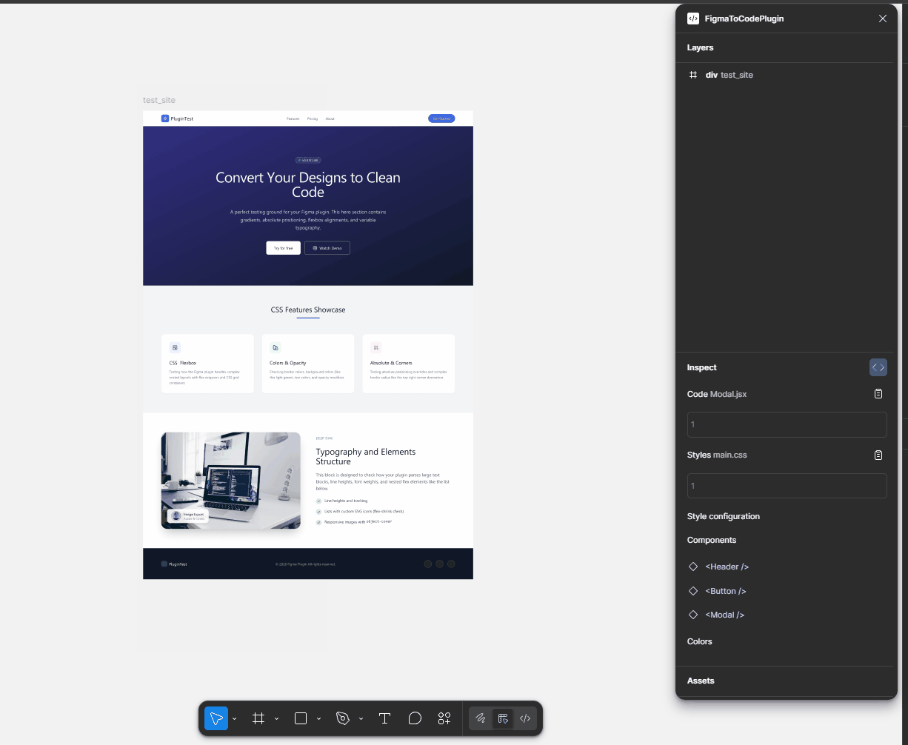
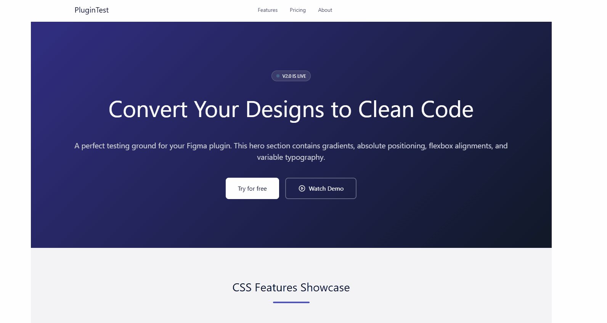

# FigmaToCodePlugin


A Figma plugin for automatic conversion of designs into clean HTML + Tailwind CSS code. Select elements on a Figma page and instantly get production-ready code with support for color palettes, images, and components.

### Plugin Demo


### Rendered Result


---

## Features

- **Figma → HTML/CSS conversion** — automatic transformation of selected frames into semantic HTML with Tailwind CSS classes
- **Layers panel** — interactive layer tree with expand/collapse and element selection
- **HTML tag reassignment** — manually set the desired HTML tag (`div`, `p`, `span`, `img`, `svg`) for each layer
- **CSS styles generation** — supports layout (Flexbox/Auto Layout), typography, colors, fills, shadows, border-radius, strokes, and transforms
- **Image handling** — automatic extraction and export of images from designs (PNG base64)
- **Color palette** — collects used colors with Tailwind class mapping
- **Tailwind Color Palette** — imports custom color palettes from Figma Variables for precise design-token matching
- **Components** — recognizes Figma instances as reusable components
- **Style configuration** — configure generation through the plugin interface
- **Project export** — generates a ready-made package with components, styles, and assets

---


## Installation & Setup

### Prerequisites

- [Node.js](https://nodejs.org/) v18+
- [Figma Desktop](https://www.figma.com/downloads/)

### Install dependencies

```bash
git clone https://github.com/deadusr/figma-to-code-plugin
cd figma-to-code-plugin
npm install
```

### Run in development mode

```bash
npm run dev
```

This command starts simultaneously:
- **TypeScript compiler** (watch mode for `plugin/` and `ui/`)
- **esbuild** (watch mode to bundle `plugin/code.ts` → `dist/code.js`)
- **Vite** (dev server for the UI)

### Connect to Figma

1. Open Figma Desktop
2. Go to **Plugins** → **Development** → **Import plugin from manifest...**
3. Select the `manifest.json` file from the project root
4. The plugin will appear under **Development** — run it on any page

### Production build

```bash
npm run build
```

---

## Usage

1. **Launch the plugin** in Figma (menu Plugins → Development → FigmaToCodePlugin)
2. **Layers panel** automatically displays the element tree of the current page
3. **Select an element** — click a layer in the plugin panel or directly on the Figma canvas
4. **View the code** — the **Inspect** section shows generated HTML and CSS (Tailwind)
5. **Adjust tags** — if needed, choose the desired HTML tag via the dropdown on each layer
6. **Configure styles** — in the **Style configuration** section, connect a custom Tailwind palette from Figma Variables
7. **Copy code** — use the copy button next to code blocks
8. **Export** — in the **Export** section, select the desired options and download a ready-made package

---

## Architecture

```
Figma Canvas
    │
    ▼
plugin/code.ts  ←──  Figma Plugin API (selection, traversal, export)
    │
    ├── codeGenerators/tags/     →  HTML tag resolution
    ├── codeGenerators/css/      →  Tailwind class generation (layout, colors, typography)
    └── codeGenerators/components/ → component detection
    │
    ▼
UI (React + Zustand)
    ├── Layers panel     — interactive tree with selection sync
    ├── Code inspector   — generated HTML + CSS preview
    └── Export panel      — download ready-made package
```

The plugin runs in two isolated contexts: the **Plugin sandbox** (`plugin/code.ts`) accesses the Figma document tree via the Plugin API, while the **UI iframe** (`ui/`) renders the interface with React. They communicate through `postMessage` with typed message contracts (`types/`).

---

## Tech Stack

| Category | Technology | Version |
|----------|------------|---------|
| UI Framework | React | 19.1 |
| Styling | Tailwind CSS | 4.1 |
| State Management | Zustand | 5.0 |

---

## Development

### Scripts

| Command | Description |
|---------|-------------|
| `npm run dev` | Start in dev mode (tsc watch + esbuild watch + vite) |
| `npm run build` | Production build (UI + Plugin) |
| `npm run build:main` | Build plugin only |
| `npm run build:ui` | Build UI only |

### Adding a new CSS generator

1. Create a file in `plugin/codeGenerators/css/<category>/`
2. Export a function that takes a `SceneNode` and returns a CSS string (Tailwind classes)
3. Wire the generator into `plugin/codeGenerators/tags/index.ts` inside `generateTagFromNode()`

### Adding a new message type

1. Add the message type to `types/messagesToPlugin.ts` or `types/messagesFromPlugin.ts`
2. Handle the message in `plugin/code.ts` (`onmessage`) or `ui/main.tsx` (`onmessage`)

### Adding a new UI component

1. Create a component in `ui/components/`
2. Style it with Tailwind classes using the design tokens from `ui/index.css`
3. Import it into `ui/App.tsx`

---

## Roadmap

- [ ] Publish to Figma Community
- [ ] React component generation (JSX)
- [ ] ZIP archive export with a complete project
- [ ] Syntax highlighting in code blocks
- [x] Copy code to clipboard

---

## License

This project is licensed under the [MIT License](LICENSE).
